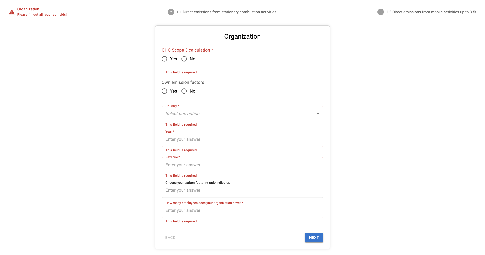

# Multi step form task

1. Create a multi-step form using MUI on React + TS.

2. API for get data: https://65e86fa34bb72f0a9c4f544a.mockapi.io/form-config

3. Using this API, you need to fetch Steps and Fields for every step and show them in the form. There are many of different field types, but for simplicity use Select (dataType 4) and Text (for everything else).

4. If one of the fields has an error, this error should be visible in the Stepper.

5. Respect isRequired, id (field name) and description properties from API.

6. Simulate sending data to this API: https://65e86fa34bb72f0a9c4f544a.mockapi.io/forms

[Demo](https://multi-step-form-steel-phi.vercel.app/)

I used (react-hook-form, material UI, axios, vite, react, typescript)
